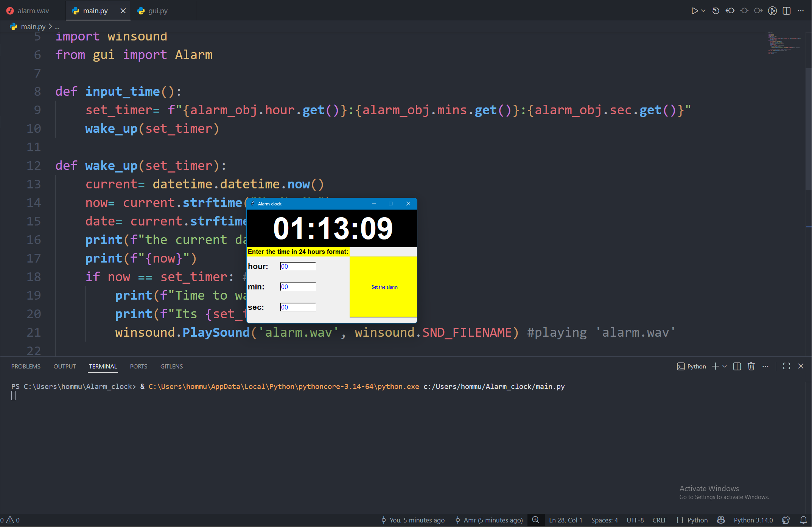

# Alarm Clock (Python Tkinter)

## Description

This is a simple Alarm Clock application built with Python using the Tkinter library.

The application displays a live digital clock, allows the user to set an alarm using the 24-hour time format, and plays a custom sound when the alarm time is reached.

This project was created to practice **Object-Oriented Programming (OOP)**, separating the graphical user interface (GUI) from the application logic, and working with Tkinter.

---

## Features

* Live digital clock
* Set an alarm using hours, minutes, and seconds
* 24-hour time format
* Plays a custom alarm sound
* Graphical User Interface (GUI) built with Tkinter
* Object-Oriented Programming (OOP)
* Separate GUI and application logic into different files

---

## Screenshot

<p align="center">
  
</p>

> Save a screenshot of the application as **`alarm_clock.png`** inside the **`images`** folder.

---

## Project Structure

```text
AlarmClock/
│
├── images/
│   └── alarm_clock.png
├── gui.py          # GUI class
├── main.py         # Main program and alarm logic
├── alarm.wav       # Alarm sound
└── README.md
```

---

## Requirements

* Python 3.x
* Tkinter (included with Python)
* winsound (Windows only)

---

## Installation

1. Clone the repository:

```bash
git clone https://github.com/your-username/AlarmClock.git
```

2. Navigate to the project folder:

```bash
cd AlarmClock
```

3. Make sure `alarm.wav` is located in the project folder.

---

## How to Run

Run the following command:

```bash
python main.py
```

---

## Technologies Used

* Python
* Tkinter
* datetime
* winsound

---

## What I Learned

Through this project I practiced:

* Creating classes
* Using constructors (`__init__`)
* Working with object attributes (`self`)
* Separating GUI from program logic
* Passing functions as callbacks
* Updating the interface using Tkinter's `after()` method
* Organizing a Python project into multiple files

---

## Future Improvements

* Validate user input before setting the alarm
* Allow multiple alarms
* Add a Stop Alarm button
* Add Snooze functionality
* Improve the user interface
* Support cross-platform alarm sounds

---

## Author

**Amr Deyab**
